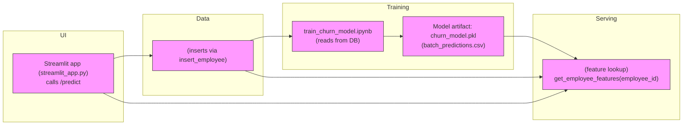

```mermaid
flowchart LR
    subgraph Data
        DB["SQLite: employees.db\n(tables: employees, salaries, jobs)"]
    end

    subgraph Training
        TN["train_churn_model.ipynb\n(reads from DB)"]
        ART["Model artifact: churn_model.pkl\n(batch_predictions.csv)"]
    end

    subgraph Serving
        API["FastAPI (model.py)\nloads churn_model.pkl\n/predict endpoint"]
    end

    subgraph UI
        WEB["Streamlit app (streamlit_app.py)\ncalls /predict"]
    end

    DB --> TN
    TN --> ART
    ART --> API
    DB --> API["(feature lookup)\nget_employee_features(employee_id)"]
    WEB --> API
    WEB --> DB["(inserts via insert_employee)"]

    classDef infra fill:#f9f,stroke:#333,stroke-width:1px;
    class DB,TN,API,WEB,ART infra
```

Architecture diagram showing data flow from the SQLite database to training, artifact creation, serving via FastAPI, and UI consumption via Streamlit.
